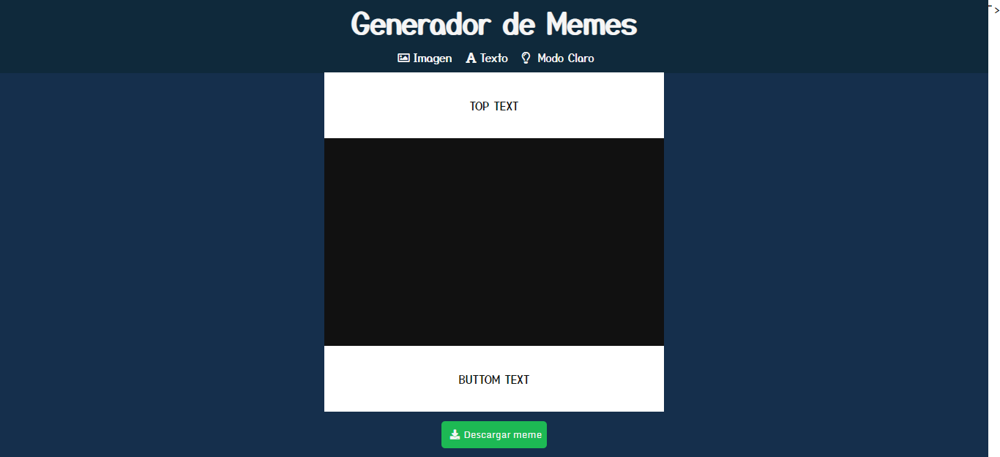
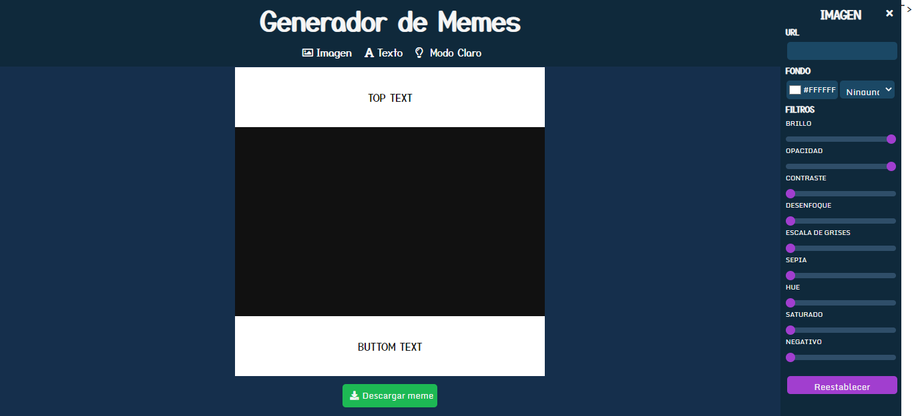
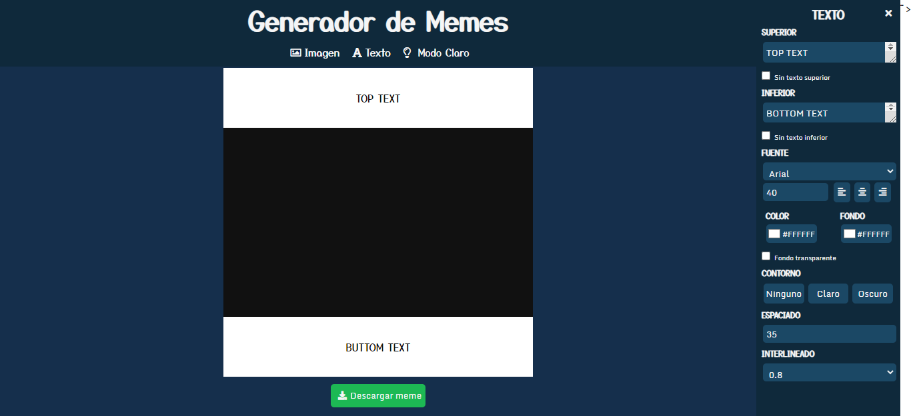

# Generador de Meme

### Este generador de meme es el segundo proyecto del Modulo 02 de ADA.

 

***

### Si queres verlo podes darle click a este [enlace](https://agustinasc.github.io/generador/.) o desde [Netifly](https://goofy-mestorf-a87adb.netlify.app/)
 

***

### Si te gustaria ver el código, tenes que seguir estos pasos en tu terminal.

- Ir al [repositorio](https://github.com/agustinasc/generador)
- Dar click al botón de forkear
- Dar click al botón de code
- Copiar la URL
- Abrir tu terminal y poner el comando de **git clone <url>**
- Entrar en la carpeta del proyecto y abrirlo desde tu IDE.

 

***

### Este proyecto no necesita la instalación de ninguna dependencia.

 

***

### Así se deberia ver al final de la instalación

 

### El panel para editar la imagen se tiene que ver así:

 

### El panel para editar el texto se tiene que ver así:

 

***
### Este editor fue desarrollado con la ayuda de las siguientes dependencias para descargar la imagen:

- [DOM To Image](https://github.com/tsayen/dom-to-image)
- [File Server](https://github.com/eligrey/FileSaver.js)

 

***

### Desarrollado por Agus 💜💜